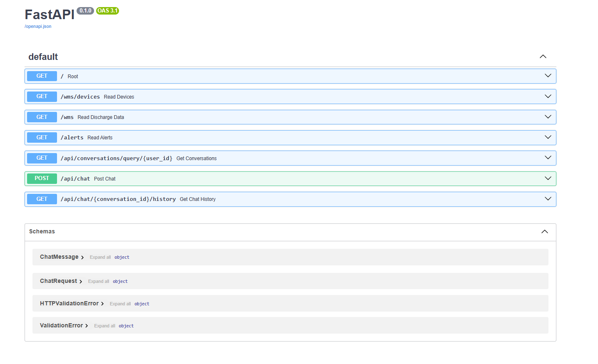

# Water Management Python Backend

A FastAPI-based backend for managing device deployments, discharge data, alerts, and chat conversations, designed for integration with modern frontend applications and deployment on Vercel.

## Features

- **FastAPI**: High-performance, async Python API framework.
- **Async SQLAlchemy**: Asynchronous database access for PostgreSQL.
- **Pydantic**: Data validation and serialization.
- **CORS Support**: Ready for frontend integration (e.g., React).
- **OpenAI Integration**: Chat endpoint powered by OpenAI models.
- **Vercel Deployment**: Configured for serverless deployment.
- **Environment Variables**: Secure configuration using `.env`.

## Project Structure

```
.
├── .gitignore
├── requirements.txt
├── vercel.json
└── app/
    ├── __init__.py
    ├── .env
    ├── chat.py
    ├── crud.py
    ├── database.py
    ├── main.py
    ├── models.py
    ├── seed.py
    └── __pycache__/
```

## Setup

1. **Clone the repository**

   ```sh
   git clone <your-repo-url>
   cd WMS-python
   ```

2. **Create and activate a virtual environment**

   ```sh
   python -m venv venv
   source venv/bin/activate  # On Windows: venv\Scripts\activate
   ```

3. **Install dependencies**

   ```sh
   pip install -r requirements.txt
   ```

4. **Configure environment variables**

   Edit `app/.env` with your database and OpenAI credentials.

5. **Run database migrations**

   The database tables are auto-created on server start.

6. **Seed initial data (optional)**

   ```sh
   python app/seed.py
   ```

7. **Run the server locally**

   ```sh
   uvicorn app.main:app --reload
   ```

## API Endpoints

- `GET /` — Health check.
- `GET /WMS/devices` — List all devices.
- `GET /WMS` — List all discharge data.
- `GET /alerts` — List all alerts.
- `POST /api/chat` — Chat endpoint (OpenAI-powered).
- `GET /api/chat/{conversation_id}/history` — Get chat history.


## Deployment

This project is configured for [Vercel](https://vercel.com/) deployment. See [`vercel.json`](vercel.json) for details.

## Technologies Used

- [FastAPI](https://fastapi.tiangolo.com/)
- [SQLAlchemy](https://docs.sqlalchemy.org/)
- [Pydantic](https://docs.pydantic.dev/)
- [OpenAI Python SDK](https://github.com/openai/openai-python)
- [Vercel](https://vercel.com/)

## License

MIT License

---

**Note:** Do not commit sensitive information such as API keys or database credentials. The `.gitignore` is set up to exclude these files.
